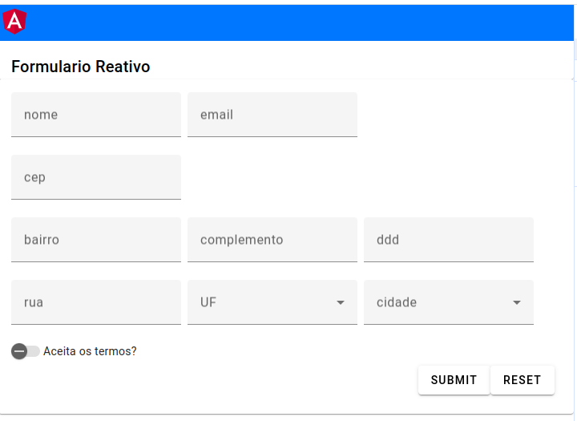

# formularioAngular
- Estudo Angular
- Referências utilizadas: Loiane.training

##
- Formulário em Angular com busca e preenchimento dos campos de acordo com o Cep.
- Utilizando angular Material.

##

